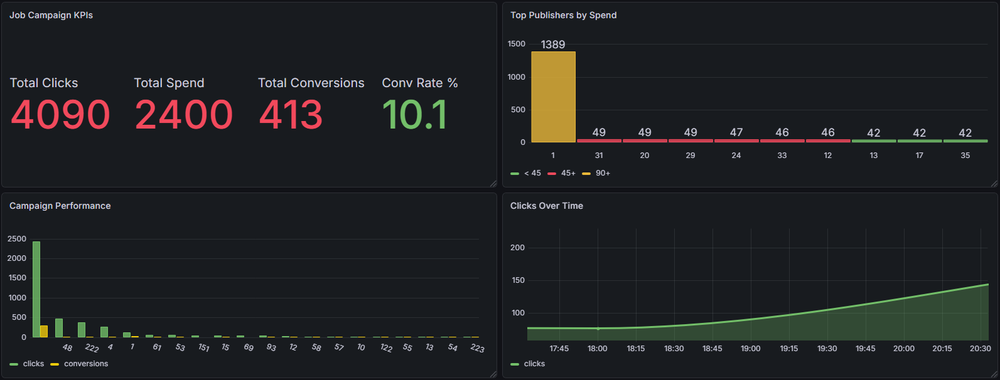

# Realtime Data Pipeline

Pipeline dữ liệu với 2 chế độ vận hành:
- **Near-realtime streaming**: `kafka_producer.py` (while True) → Kafka → Spark Structured Streaming → MySQL → Grafana
- **Scheduled batch với orchestration**: Apache Airflow (mỗi 1 phút) → `kafka_producer_batch.py` → Kafka → Spark Structured Streaming → MySQL → Grafana

---

## Kiến trúc

### Chế độ 1 – Near-realtime Streaming

```
MySQL (master: job, master_publisher)
        │
        │  kafka_producer.py (while True, ~20s/batch)
        ▼
  Apache Kafka  ←── event stream liên tục
  topic: tracking-events
        │
        │  spark_streaming_consumer.py (trigger mỗi 10 giây)
        ▼
  Apache Spark Structured Streaming
        │
        ▼
  MySQL table: events
        │
        ▼
  Grafana (cập nhật liên tục)
```

### Chế độ 2 – Scheduled Batch + Orchestration

```
  Apache Airflow (cron: mỗi 1 phút)
        │
        ├─ Task 1: check_mysql       (kiểm tra kết nối MySQL)
        ├─ Task 2: run_producer_batch (gửi 50 events → Kafka)
        ├─ Task 3: wait_for_spark    (chờ 30s)
        └─ Task 4: verify_data       (kiểm tra data đã vào MySQL)
                │
        kafka_producer_batch.py
                │
          Apache Kafka
                │
  Spark Structured Streaming (long-running, chạy song song)
                │
          MySQL table: events
                │
        Grafana (cập nhật sau mỗi batch)
```

---

## Cấu trúc thư mục

```
Realtime_project/
├── docker-compose.yml
├── README.md
├── data/
│   ├── cassandra/
│   │   └── tracking.csv                 # dữ liệu tracking mẫu (tham khảo)
│   └── mysql/
│       ├── job.csv                      # dữ liệu job mẫu
│       └── events.csv                   # dữ liệu events mẫu
├── scripts/                             # production scripts
│   ├── kafka_producer.py                # MySQL → generate events → Kafka (vòng lặp liên tục)
│   ├── kafka_producer_batch.py          # MySQL → generate events → Kafka (gửi 1 batch rồi thoát)
│   └── spark_streaming_consumer.py      # Kafka → aggregate → MySQL events
├── dags/                                # Apache Airflow DAGs
    └── job_tracking_pipeline.py         # DAG tự động hóa toàn bộ pipeline

```

---

## Services (Docker)

| Service | Image | Port | Mô tả |
|---|---|---|---|
| mysql | mysql:8.0 | 3306 | Master data: job, master_publisher, events |
| cassandra | cassandra:latest | 9042 | (tham khảo) tracking storage |
| zookeeper | confluentinc/cp-zookeeper:7.4.0 | 2181 | Kafka coordinator |
| broker | confluentinc/cp-kafka:7.4.0 | 9092 | Kafka broker |
| control-center | confluentinc/cp-enterprise-control-center:7.4.0 | 9021 | Kafka UI |
| schema-registry | confluentinc/cp-schema-registry:7.4.0 | 8081 | Schema registry |
| connect | confluentinc/cp-kafka-connect:7.4.0 | 8083 | Kafka Connect |
| pyspark | custom pyspark | - | Spark engine |
| grafana | grafana/grafana:latest | 3000 | Real-time dashboard |

---

## Cài đặt

### 1. Khởi động Docker

```bash
docker-compose up -d
```

Kiểm tra services chạy đủ:
```bash
docker-compose ps
```

### 2. Cài đặt thư viện Python

```bash
pip install kafka-python mysql-connector-python pandas findspark pyspark
```

---

## Chạy pipeline

Có **2 cách** chạy pipeline, tùy theo mục đích sử dụng:

---

### Cách 1 – Near-realtime Streaming (While True)

Producer chạy **liên tục**, Spark Consumer đọc mỗi **10 giây** → data vào Grafana gần như tức thì. Phù hợp để **demo realtime** hoặc **load test**.

**Bước 1 – Khởi động Kafka Producer (liên tục)**

```bash
python scripts/kafka_producer.py
```

- Mỗi 20 giây gửi 1–20 events ngẫu nhiên
- Kafka topic: `tracking-events`
- Phân bổ: click (70%), conversion (10%), qualified (10%), unqualified (10%)
- Dừng bằng: `Ctrl+C`

**Bước 2 – Khởi động Spark Streaming Consumer**

```bash
python scripts/spark_streaming_consumer.py
```

- Trigger: mỗi 10 giây
- Watermark: chấp nhận event đến trễ tối đa 10 phút
- Checkpoint: `C:/Users/Admin/spark_streaming_ckpt`
- Output table: MySQL `events`
- Dừng bằng: `Ctrl+C`

**Bước 3 – Xem kết quả**

- **Kafka Control Center**: http://localhost:9021 — xem topics, messages, consumers
- **Grafana Dashboard**: http://localhost:3000 — visualize KPIs, data cập nhật liên tục (login: admin/admin)

---

### Cách 2 – Scheduled Batch với Apache Airflow

Airflow trigger pipeline **mỗi 1 phút** (có thể chỉnh), mỗi lần gửi **50 events**. Không phải realtime, nhưng có **orchestration đầy đủ**: retry tự động, monitoring, dependency giữa các task. Phù hợp cho **production có kiểm soát**. DAG bao gồm 4 task nối tiếp nhau:

```
check_mysql  →  run_producer_batch  →  wait_for_spark  →  verify_data
```

| Task | Mô tả |
|------|-------|
| `check_mysql` | Kiểm tra kết nối MySQL, thất bại = dừng toàn bộ DAG |
| `run_producer_batch` | Chạy `kafka_producer_batch.py` — gửi đúng 50 events rồi thoát |
| `wait_for_spark` | Chờ 30 giây để Spark xử lý xong batch |
| `verify_data` | Query `SELECT COUNT(*) FROM events`, ghi log số bản ghi |

**Yêu cầu**: Apache Airflow đã được cài đặt (xem hướng dẫn bên dưới)

**Bước 1 – Khởi động Airflow (nếu chưa chạy)**

```bash
# Khởi tạo DB lần đầu
airflow db init

# Tạo user admin
airflow users create --role Admin --username admin --email admin@admin.com \
  --firstname admin --lastname admin --password admin

# Chạy webserver và scheduler
nohup airflow webserver --port 8080 > ~/airflow/logs/webserver.log 2>&1 &
nohup airflow scheduler > ~/airflow/logs/scheduler.log 2>&1 &
```

**Bước 2 – Copy DAG vào Airflow**

```bash
# Linux / WSL
cp dags/job_tracking_pipeline.py ~/airflow/dags/

# Windows (nếu AIRFLOW_HOME khác)
copy dags\job_tracking_pipeline.py %AIRFLOW_HOME%\dags\
```

**Bước 3 – Spark Streaming Consumer vẫn cần chạy riêng**

```bash
python scripts/spark_streaming_consumer.py
```

> Airflow chỉ điều phối phần producer (gửi event vào Kafka). Spark Streaming là một long-running process nên chạy song song độc lập.

**Bước 4 – Truy cập Airflow UI**

- **Airflow UI**: http://localhost:8080 (login: admin/admin)
- Tìm DAG `job_tracking_pipeline` → bấm **▶ Trigger DAG** để chạy thủ công, hoặc để tự động theo lịch

**Bước 5 – Xem kết quả**

- **Grafana Dashboard**: http://localhost:3000 — dữ liệu cập nhật sau mỗi batch (mặc định 1 phút/lần)

---

## Schema

### Input – Kafka message (JSON)

| Field | Type | Mô tả |
|---|---|---|
| create_time | string (UUID v1) | Thời điểm tạo event |
| bid | int (0 or 1) | Giá thầu |
| campaign_id | int | ID chiến dịch |
| custom_track | string | click / conversion / qualified / unqualified |
| group_id | int | ID nhóm |
| job_id | int | ID công việc |
| publisher_id | int | ID nhà xuất bản |
| ts | string (yyyy-MM-dd HH:mm:ss) | Timestamp event |

### Output – MySQL table `events`

| Field | Type | Mô tả |
|---|---|---|
| job_id | int | ID công việc |
| dates | date | Ngày |
| hours | int | Giờ |
| disqualified_application | long | Số unqualified |
| qualified_application | long | Số qualified |
| conversion | long | Số conversion |
| company_id | int | ID công ty (join từ job) |
| group_id | int | ID nhóm |
| campaign_id | int | ID chiến dịch |
| publisher_id | int | ID nhà xuất bản |
| bid_set | double | Trung bình bid của click |
| clicks | long | Số click |
| spend_hour | double | Tổng bid của click |
| sources | string | "Kafka-Streaming" |
| updated_at | string | Thời điểm ghi vào MySQL |

---

## Notebooks (để test / học)

| Notebook | Mô tả |
|---|---|
| `notebooks/test_kafka_producer.ipynb` | Chạy từng cell để hiểu cách producer kết nối MySQL, sinh event, gửi Kafka, verify offset |
| `notebooks/spark_streaming_consumer.ipynb` | Chạy từng cell để hiểu schema, readStream, watermark, aggregate, foreachBatch |

---

## Config mặc định

| Tham số | Giá trị |
|---|---|
| KAFKA_BROKER | localhost:9092 |
| KAFKA_TOPIC | tracking-events |
| MYSQL_HOST | localhost |
| MYSQL_PORT | 3306 |
| MYSQL_DATABASE | logs |
| MYSQL_USER | root |
| MYSQL_PASSWORD | 1 |
| CASSANDRA_HOST | localhost |
| CASSANDRA_PORT | 9042 |
| GRAFANA_URL | http://localhost:3000 |
| CHECKPOINT_DIR | C:/Users/Admin/spark_streaming_ckpt |

---

## Dashboard



### Key Metrics

| Metric | Description |
|--------|-------------|
| Total Clicks | Tổng số lần click vào job ads |
| Total Spend | Tổng chi phí quảng cáo (bid × clicks) |
| Total Conversions | Số lượt apply thành công |
| Conversion Rate % | Tỷ lệ chuyển đổi click → apply |

### Panels

| Panel | Type | Mô tả |
|-------|------|-------|
| Job Campaign KPIs | Stat | 4 chỉ số tổng quan |
| Campaign Performance | Bar chart | Clicks & conversions theo campaign |
| Top Publishers by Spend | Bar chart | Top publishers tốn spend nhiều nhất |
| Clicks Over Time | Time series | Xu hướng clicks theo giờ |
